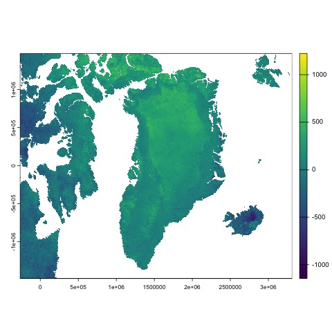

# Reporting multitemporal analysis in R

First of all, we should import an image by:
```r
im.list() # Make a list
gr = im.import("greenland") # To import an image
```

Then, we might calculate the difference of values of two images
```r
grdif = gr[[4]] - gr[[1]]
```
This will create the following output image: 



> Note 1: Se vuoi metterci il file PDF cerca il tutorial su Stack overflow

> Note 2: Se vuoi info sul programma [Copernicus](https://www.copernicus.eu/it/taxonomy/term/1232) dell'Esa


